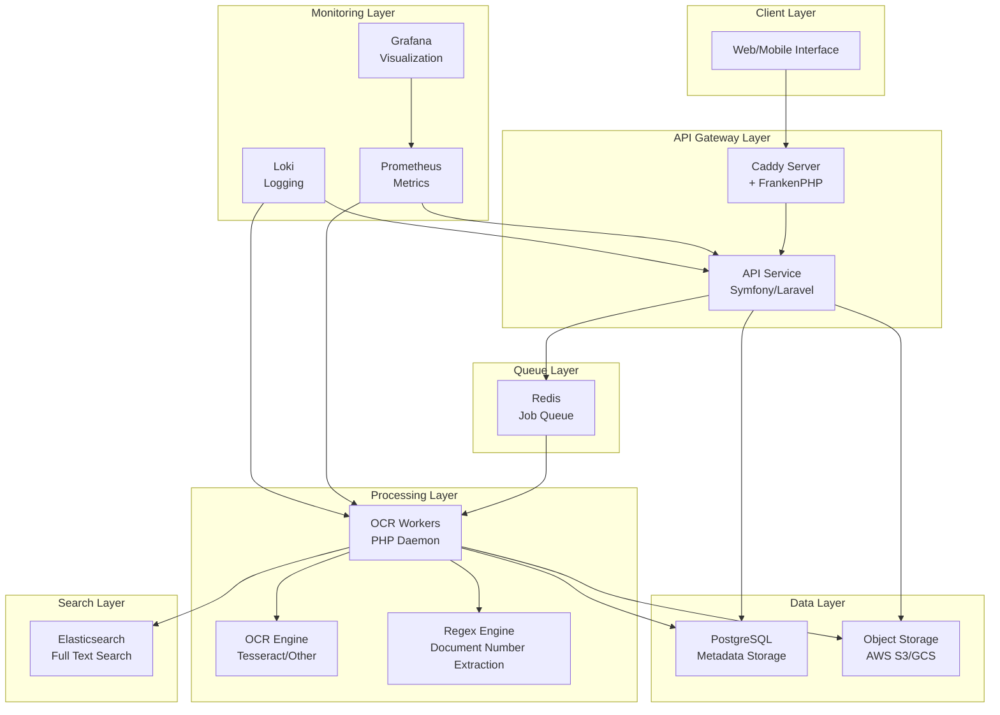

# Technical Documentation - Document OCR & Archival System

## Overview

Document OCR & Archival System adalah solusi manajemen dokumen terdistribusi dan asinkron yang dirancang untuk menyimpan, mengindeks, dan mencari dokumen digital (terutama PDF) secara efisien berdasarkan metadata dan nomor dokumen yang diekstraksi otomatis melalui OCR.

### Arsitektur Keseluruhan

Sistem ini mengikuti arsitektur berbasis layanan mikro terdistribusi dengan komponen-komponen berikut:



## Komponen Utama

### 1. Aplikasi Web (API)
- **Teknologi**: FrankenPHP + Symfony/Laravel
- **Fungsi**: Menyediakan endpoint API untuk upload dokumen, pencarian, dan manajemen dokumen
- **Fitur**:
  - Otentikasi & otorisasi berbasis JWT
  - Validasi input ketat
  - Upload file ke object storage
  - Queue job untuk pemrosesan OCR

### 2. Web Server
- **Teknologi**: Caddy (Built-in FrankenPHP)
- **Fungsi**: Reverse proxy dan SSL termination
- **Fitur**:
  - HTTP/3 support
  - SSL certificate management otomatis
  - Load balancing (jika diperlukan)

### 3. Database Primer (Metadata)
- **Teknologi**: PostgreSQL (v14+)
- **Fungsi**: Menyimpan metadata dokumen dan informasi pengguna
- **Tabel-tabel utama**:
  - `users`: Informasi akun pengguna
  - `documents`: Metadata dokumen (judul, deskripsi, status, nomor dokumen yang diekstrak, dll.)
  - `document_categories`: Kategori dokumen
  - `jobs`: Queue job untuk pemrosesan OCR
  - `failed_jobs`: Daftar job yang gagal

### 4. Object Storage (File)
- **Teknologi**: AWS S3 / Google Cloud Storage
- **Fungsi**: Menyimpan file dokumen secara skalabel dan tahan lama
- **Fitur**:
  - Penyimpanan horizontal
  - Ketersediaan tinggi
  - Biaya efektif

### 5. Antrean/Queue Broker
- **Teknologi**: Redis
- **Fungsi**: Menyediakan broker antrean untuk pemrosesan asinkron
- **Fitur**:
  - High-performance in-memory broker
  - Dead Letter Queue untuk job yang gagal
  - Retry mechanism

### 6. OCR & Index Worker
- **Teknologi**: Dedicated PHP Workers
- **Fungsi**: Menjalankan proses OCR dan ekstraksi nomor dokumen
- **Fitur**:
  - Pemrosesan asinkron
  - Ekstraksi teks dari berbagai format file
  - Ekstraksi nomor dokumen menggunakan regex
  - Update status ke database dan index ke Elasticsearch

### 7. Pencarian Teks Penuh
- **Teknologi**: Elasticsearch / OpenSearch
- **Fungsi**: Menyediakan mesin pencarian terdistribusi untuk pencarian teks penuh
- **Fitur**:
  - Pencarian fuzzy
  - Highlighting hasil pencarian
  - Pencarian berdasarkan nomor dokumen

### 8. Monitoring/Logging
- **Teknologi**: Prometheus/Grafana + ELK Stack/Loki
- **Fungsi**: Menyediakan observability untuk sistem
- **Fitur**:
  - Metrics collection (worker lag, request latency, job status)
  - Visualisasi dengan Grafana
  - Centralized logging dengan Loki
  - Alerting untuk kondisi kritis

## Alur Proses Utama

### 1. Upload Dokumen
1. Client mengirim `POST /api/documents` dengan file dan metadata
2. API memvalidasi request dan menyimpan file ke S3
3. API mencatat `document` di PostgreSQL dengan `status = PENDING`
4. API mengirim `DocumentIngestJob(document_id)` ke **Redis Queue**
5. API mengembalikan `HTTP 202 Accepted` (pemrosesan sedang berlangsung)
6. Worker mengambil job dari antrean
7. Worker mengunduh file dari S3
8. Worker menjalankan OCR untuk mengekstrak teks
9. Worker menerapkan RegEx untuk mengidentifikasi `extracted_doc_number`
10. Worker memperbarui `documents.status = PROCESSED` dan `documents.extracted_doc_number` di PostgreSQL
11. Worker mengirim full-text hasil OCR dan metadata ke **Elasticsearch**

### 2. Pencarian Dokumen
1. Client mengirim query ke `GET /api/search?q={query}`
2. API mengarahkan ke Elasticsearch untuk pencarian teks penuh
3. Elasticsearch mengembalikan hasil yang cocok
4. API menyaring hasil berdasarkan izin pengguna
5. API mengembalikan hasil pencarian dalam format JSON

## Struktur Direktori

```
document-ocr-archival/
├── app/                    # Core application logic
│   ├── Controllers/        # Request handlers
│   ├── Models/             # Data models
│   ├── Services/           # Business logic
│   ├── Repositories/       # Data access layer
│   └── DTOs/               # Data transfer objects
├── bootstrap/              # Application bootstrapping
├── config/                 # Configuration files
├── database/               # Migrations and seeds
├── public/                 # Web root
├── src/                    # Shared libraries
├── storage/                # File storage
├── tests/                  # Test files
├── workers/                # Background job processors
├── vendor/                 # Composer dependencies
├── docs/                   # Documentation
├── .env                    # Environment variables
├── composer.json           # PHP dependencies
├── docker-compose.yml      # Docker orchestration
├── Dockerfile              # Main Docker configuration
└── README.md               # Documentation
```

## Konfigurasi Lingkungan

### Variabel Lingkungan Utama

#### Aplikasi
- `APP_ENV`: Lingkungan aplikasi (production, development, testing)
- `APP_DEBUG`: Mode debug (true/false)
- `APP_URL`: URL dasar aplikasi
- `APP_PORT`: Port aplikasi berjalan

#### Database
- `DB_CONNECTION`: Jenis koneksi database (pgsql, mysql)
- `DB_HOST`: Host database
- `DB_PORT`: Port database
- `DB_DATABASE`: Nama database
- `DB_USERNAME`: Username database
- `DB_PASSWORD`: Password database

#### Redis
- `REDIS_HOST`: Host Redis
- `REDIS_PORT`: Port Redis
- `REDIS_PASSWORD`: Password Redis (jika ada)
- `REDIS_DB`: Database Redis

#### Elasticsearch
- `ELASTICSEARCH_HOST`: Host Elasticsearch
- `ELASTICSEARCH_PORT`: Port Elasticsearch
- `ELASTICSEARCH_INDEX`: Nama indeks utama

#### S3 Storage
- `S3_BUCKET`: Nama bucket S3
- `S3_KEY`: Access key S3
- `S3_SECRET`: Secret key S3
- `S3_REGION`: Region S3
- `S3_ENDPOINT`: Endpoint S3 (jika menggunakan S3-compatible storage)

#### JWT
- `JWT_SECRET`: Secret key untuk JWT
- `JWT_REFRESH_SECRET`: Secret key untuk refresh token
- `JWT_TTL`: TTL untuk access token (menit)
- `JWT_REFRESH_TTL`: TTL untuk refresh token (menit)

#### OCR
- `OCR_ENGINE`: Mesin OCR (tesseract, google_vision, aws_textract)
- `OCR_TIMEOUT`: Timeout untuk proses OCR (detik)
- `OCR_LANGUAGE`: Bahasa untuk OCR (eng, ind, etc.)

## API Endpoints

### Otentikasi
- `POST /api/auth/login` - Login pengguna
- `POST /api/auth/register` - Registrasi pengguna baru
- `POST /api/auth/refresh` - Refresh token

### Dokumen
- `POST /api/documents` - Upload dokumen baru (mengembalikan HTTP 202)
- `GET /api/documents` - Dapatkan daftar dokumen
- `GET /api/documents/{id}` - Dapatkan detail dokumen
- `GET /api/documents/{id}/download` - Download dokumen
- `GET /api/documents/{id}/status` - Dapatkan status pemrosesan dokumen

### Pencarian
- `GET /api/search?q={query}` - Pencarian dokumen berdasarkan kata kunci
- `GET /api/search/advanced` - Pencarian lanjutan dengan filter

### Kategori
- `GET /api/categories` - Dapatkan daftar kategori
- `POST /api/categories` - Buat kategori baru
- `PUT /api/categories/{id}` - Update kategori
- `DELETE /api/categories/{id}` - Hapus kategori

## Model Data

### User Model
- `id`: BIGSERIAL (primary key)
- `email`: VARCHAR(255) (unique)
- `password_hash`: VARCHAR(255)
- `role`: VARCHAR(50) (default: 'user')
- `permissions`: JSON (array of permissions)
- `is_active`: BOOLEAN (default: true)
- `last_login_at`: TIMESTAMP (nullable)
- `created_at`: TIMESTAMP
- `updated_at`: TIMESTAMP

### Document Model
- `id`: UUID (primary key)
- `uploaded_by_id`: BIGINT (foreign key to users)
- `s3_path`: TEXT (location in object storage)
- `title`: VARCHAR(255)
- `description`: TEXT (nullable)
- `category_id`: INT (foreign key to categories, nullable)
- `status`: VARCHAR(20) (PENDING, PROCESSING, PROCESSED, FAILED)
- `extracted_doc_number`: VARCHAR(100) (indexed)
- `full_text_indexed`: BOOLEAN (default: false)
- `ocr_metadata`: JSONB (confidence scores, engine version, etc.)
- `created_at`: TIMESTAMP
- `updated_at`: TIMESTAMP
- `processed_at`: TIMESTAMP (nullable)

### DocumentCategory Model
- `id`: INT (primary key)
- `name`: VARCHAR(100)
- `description`: TEXT (nullable)
- `created_at`: TIMESTAMP
- `updated_at`: TIMESTAMP

## Skema Database

### Tabel `documents`
```sql
CREATE TABLE documents (
    id UUID PRIMARY KEY DEFAULT gen_random_uuid(),
    uploaded_by_id BIGINT NOT NULL,
    s3_path TEXT NOT NULL UNIQUE,
    title VARCHAR(255) NOT NULL,
    description TEXT,
    category_id INT,
    status VARCHAR(20) NOT NULL DEFAULT 'PENDING',
    extracted_doc_number VARCHAR(100),
    full_text_indexed BOOLEAN NOT NULL DEFAULT FALSE,
    ocr_metadata JSONB,
    created_at TIMESTAMPTZ NOT NULL DEFAULT NOW(),
    updated_at TIMESTAMPTZ NOT NULL DEFAULT NOW(),
    processed_at TIMESTAMPTZ NULL,
    
    CONSTRAINT fk_documents_user FOREIGN KEY (uploaded_by_id) REFERENCES users(id) ON DELETE RESTRICT,
    CONSTRAINT fk_documents_category FOREIGN KEY (category_id) REFERENCES document_categories(id) ON DELETE SET NULL
);

-- Index penting
CREATE INDEX idx_documents_status ON documents(status);
CREATE INDEX idx_documents_extracted_doc_number ON documents(extracted_doc_number);
CREATE INDEX idx_documents_uploaded_by_id ON documents(uploaded_by_id);
CREATE INDEX idx_documents_category_id ON documents(category_id);
CREATE INDEX idx_documents_created_at ON documents(created_at);
```

### Tabel `users`
```sql
CREATE TABLE users (
    id BIGSERIAL PRIMARY KEY,
    email VARCHAR(255) UNIQUE NOT NULL,
    password_hash VARCHAR(255) NOT NULL,
    role VARCHAR(50) DEFAULT 'user',
    permissions JSON DEFAULT '[]',
    is_active BOOLEAN DEFAULT TRUE,
    last_login_at TIMESTAMPTZ NULL,
    created_at TIMESTAMPTZ NOT NULL DEFAULT NOW(),
    updated_at TIMESTAMPTZ NOT NULL DEFAULT NOW()
);
```

### Tabel `document_categories`
```sql
CREATE TABLE document_categories (
    id SERIAL PRIMARY KEY,
    name VARCHAR(100) NOT NULL,
    description TEXT,
    created_at TIMESTAMPTZ NOT NULL DEFAULT NOW(),
    updated_at TIMESTAMPTZ NOT NULL DEFAULT NOW()
);
```

## Implementasi Keamanan

### Otentikasi
- JWT token dengan refresh mechanism
- Token disimpan di Redis untuk manajemen session
- Blacklisting token untuk logout

### Otorisasi
- Role-Based Access Control (RBAC)
- Permission checking di setiap endpoint yang dilindungi
- Hirarki role: admin > user > viewer

### Validasi Input
- Validasi ketat untuk semua input pengguna
- Sanitasi sebelum menyimpan ke database
- Konfigurasi regex untuk ekstraksi nomor dokumen

### Perlindungan Data
- Tidak ada hardcoded secrets
- Enkripsi data di transit (HTTPS)
- Enkripsi data di rest (PostgreSQL/S3 encryption)

## Testing

### Strategi Testing
Mengikuti piramida testing (70% unit, 20% integration, 10% E2E):

- **Unit Tests (70%)**: Fungsi dan kelas individual
- **Integration Tests (20%)**: Endpoint API, query database, dan komponen utama
- **E2E Tests (10%)**: Workflow pengguna kritis

### Tools Testing
- PHPUnit untuk unit dan integration testing
- PestPHP untuk testing yang lebih ringkas (opsional)
- Mock untuk dependensi eksternal

## Deployment

### Production Deployment
- Docker dan Docker Compose untuk containerization
- Multi-stage builds untuk optimalisasi
- Health checks untuk semua layanan
- Monitoring dan alerting

### Scaling
- Horizontal scaling untuk API services
- Multiple worker processes untuk OCR
- Elasticsearch cluster untuk pencarian
- PostgreSQL replication untuk database

## Monitoring dan Logging

### Metrics
- Request rate dan response time
- Queue length dan processing rate
- Database connection pool
- Memory dan CPU usage

### Logging
- Structured logging dalam format JSON
- Centralized logging dengan Loki
- Log level konfigurabel
- Masking data sensitif

### Alerting
- High error rate (>10%)
- Queue backlog melampaui threshold
- Database connection failures
- Elasticsearch unavailability