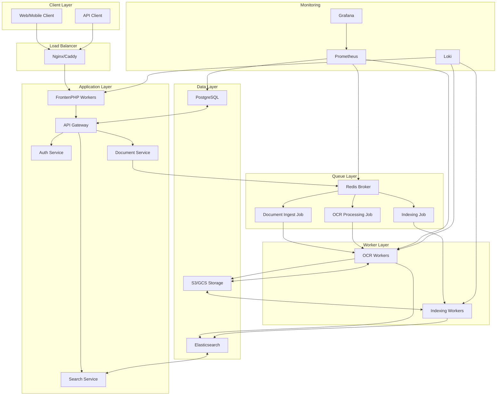

# System Architecture - Document OCR & Archival System

## Ikhtisar
Dokumen ini menjelaskan arsitektur keseluruhan sistem Document OCR & Archival System, termasuk komponen-komponen utama, interaksi antar layanan, dan prinsip-prinsip desain yang digunakan.

## Arsitektur Keseluruhan

### Diagram Arsitektur


## Komponen Utama

### 1. Application Layer
#### FrankenPHP Workers
- **Deskripsi**: Runtime PHP berkinerja tinggi yang digunakan sebagai web server
- **Fungsi**: Menangani permintaan HTTP dan menjalankan aplikasi PHP
- **Keunggulan**: Kinerja mendekati C++/Go sambil tetap menggunakan PHP

#### API Gateway
- **Deskripsi**: Titik masuk utama untuk semua permintaan API
- **Fungsi**: 
  - Routing permintaan ke layanan yang tepat
  - Validasi autentikasi dan otorisasi
  - Rate limiting dan throttling
  - Logging dan monitoring

#### Auth Service
- **Deskripsi**: Layanan autentikasi dan otorisasi terpusat
- **Fungsi**:
  - Manajemen sesi pengguna
  - Validasi JWT token
  - Role-based access control (RBAC)

#### Document Service
- **Deskripsi**: Layanan utama untuk manajemen dokumen
- **Fungsi**:
  - Upload dan manajemen dokumen
  - Interaksi dengan queue untuk pemrosesan asinkron
  - Validasi dan transformasi data

#### Search Service
- **Deskripsi**: Layanan untuk pencarian dokumen
- **Fungsi**:
  - Query ke Elasticsearch
  - Pembuatan dan manajemen indeks
  - Saran dan autocomplete

### 2. Queue Layer
#### Redis Broker
- **Deskripsi**: Queue broker berbasis Redis
- **Fungsi**:
  - Menyimpan job untuk pemrosesan asinkron
  - Menyediakan FIFO queue untuk pekerjaan
  - Menyediakan pub/sub untuk komunikasi antar layanan

#### Job Types
- **Document Ingest Job**: Menangani upload dokumen baru
- **OCR Processing Job**: Melakukan ekstraksi teks dan nomor dokumen
- **Indexing Job**: Mengindeks dokumen ke Elasticsearch

### 3. Worker Layer
#### OCR Workers
- **Deskripsi**: Proses background untuk pemrosesan OCR
- **Fungsi**:
  - Menjalankan OCR engine (Tesseract)
  - Mengekstrak nomor dokumen menggunakan regex
  - Membersihkan dan memformat teks hasil OCR

#### Indexing Workers
- **Deskripsi**: Proses background untuk pengindeksan
- **Fungsi**:
  - Mengindeks dokumen ke Elasticsearch
  - Memperbarui status pengindeksan
  - Menangani error dan retry

### 4. Data Layer
#### PostgreSQL
- **Deskripsi**: Database relasional utama
- **Fungsi**:
 - Menyimpan metadata dokumen
 - Menyimpan informasi pengguna dan kategori
 - Menyimpan status pemrosesan dan log audit

#### S3/GCS Storage
- **Deskripsi**: Object storage untuk file dokumen
- **Fungsi**:
 - Menyimpan file dokumen (PDF, gambar)
  - Menyediakan akses aman ke file
  - Menyediakan skalabilitas horizontal

#### Elasticsearch
- **Deskripsi**: Mesin pencarian teks penuh
- **Fungsi**:
  - Menyediakan pencarian teks penuh
  - Menyediakan pencocokan nomor dokumen
  - Menyediakan autocomplete dan saran

## Alur Pemrosesan

### 1. Upload Dokumen
```
Client -> API Gateway -> Document Service -> S3/GCS -> Queue -> OCR Worker -> Elasticsearch
```

1. Client mengirim dokumen ke API
2. API Gateway memvalidasi autentikasi
3. Document Service menyimpan metadata ke PostgreSQL
4. File diupload ke S3/GCS
5. Job OCR dikirim ke queue
6. OCR Worker mengambil job dan memproses dokumen
7. Hasil OCR diindeks ke Elasticsearch

### 2. Pencarian Dokumen
```
Client -> API Gateway -> Search Service -> Elasticsearch -> Client
```

1. Client mengirim permintaan pencarian
2. API Gateway memvalidasi autentikasi
3. Search Service membangun query Elasticsearch
4. Elasticsearch mencari dan mengembalikan hasil
5. Hasil dikembalikan ke client

## Prinsip Arsitektur

### 1. Scalability
- **Horizontal Scaling**: Semua komponen dirancang untuk dapat diskalakan secara horizontal
- **Queue-based Processing**: Memungkinkan pemrosesan paralel
- **Stateless Services**: Layanan tidak menyimpan state lokal

### 2. Reliability
- **Dead Letter Queue**: Untuk menangani job yang gagal
- **Retry Mechanism**: Dengan exponential backoff
- **Health Checks**: Untuk memantau kesehatan layanan

### 3. Security
- **Zero Trust Architecture**: Semua komunikasi diverifikasi
- **JWT Authentication**: Untuk manajemen sesi
- **Encryption**: Data di-transit dan di-rest

### 4. Performance
- **Caching**: Menggunakan Redis untuk caching
- **Connection Pooling**: Untuk database dan layanan eksternal
- **Asynchronous Processing**: Untuk operasi berat

## Deployment Architecture

### Production Setup
```
┌─────────────────┐    ┌─────────────────┐    ┌─────────────────┐
│   Load         │ -> │  Application    │ -> │   Database &    │
│   Balancer     │    │  Servers        │    │   Storage       │
│   (Caddy)      │    │  (FrankenPHP)   │    │   Cluster       │
└─────────────────┘    └─────────────────┘    └─────────────────┘
         │                       │                       │
         ▼                       ▼
┌─────────────────┐    ┌─────────────────┐    ┌─────────────────┐
│   CDN &        │    │  Queue &        │    │  Search &       │
│   Caching      │    │  Worker         │    │   Monitoring    │
│   Layer        │    │  Cluster        │    │   Cluster       │
└─────────────────┘    └─────────────────┘    └─────────────────┘
```

### Container Deployment
- **Docker**: Untuk packaging aplikasi
- **Docker Compose**: Untuk orchestration lokal
- **Kubernetes**: Untuk deployment produksi (opsional)

## Monitoring dan Observability

### Metrics
- **Application**: Request rate, error rate, response time
- **Database**: Query performance, connection count
- **Queue**: Job processing rate, queue length
- **OCR Workers**: Processing time, success rate
- **Search**: Query performance, index size

### Logging
- **Structured Logging**: Format JSON untuk semua log
- **Centralized Logging**: Menggunakan Loki untuk agregasi
- **Log Redaction**: Menyembunyikan data sensitif dari log

### Alerting
- **High Error Rate**: (>5% dalam 5 menit)
- **Slow Response Time**: (>2 detik rata-rata)
- **Queue Backlog**: (>100 jobs dalam antrian)
- **Resource Exhaustion**: (CPU, memory, disk usage tinggi)

## Security Architecture

### Network Security
- **TLS 1.2+**: Untuk semua komunikasi
- **Firewall Rules**: Membatasi akses ke layanan
- **API Rate Limiting**: Mencegah abuse

### Data Security
- **Encryption at Rest**: Untuk data sensitif di database
- **Encryption in Transit**: Untuk semua komunikasi
- **Access Control**: Berbasis peran dan izin

### Application Security
- **Input Validation**: Validasi semua input pengguna
- **SQL Injection Prevention**: Menggunakan prepared statements
- **XSS Prevention**: Sanitasi output dan header keamanan

## Kesimpulan

Arsitektur Document OCR & Archival System dirancang untuk menyediakan sistem manajemen dokumen yang skalabel, aman, dan handal. Dengan pendekatan berbasis queue dan pemrosesan asinkron, sistem mampu menangani volume besar dokumen sambil menyediakan kemampuan pencarian yang cepat dan akurat.